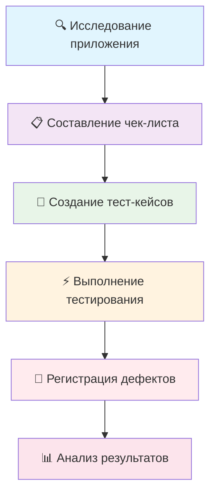

# 📱 Тестирование мобильного приложения "Список покупок"

## 📋 О проекте
Комплексное тестирование мобильного приложения для ведения списка покупок с использованием исследовательского тестирования без требований.

## 🎯 Демонстрируемые навыки
- Исследовательское тестирование без документации
- Тестирование мобильных приложений
- Создание тестовой документации с нуля
- Баг-репортинг и работа с Jira
- Анализ пользовательских сценариев

## 🛠️ Технологии и инструменты

 
 
 
 
 

## 📊 Ключевые результаты
- ✅ Проведено исследовательское тестирование без требований и макетов
- ✅ Созданы Чек-лист на 35 проверок и 12 тест-кейсов
- ✅ Выявлено 7 дефектов, включая 1 критический (Crash приложения)
- ✅ Протестированы основные пользовательские сценарии работы со списком покупок

## 🔗 Ресурсы проекта
- [📱 Тестируемое приложение](https://drive.google.com/file/d/1wSz1J4Ba-VDgjv82RIk59EaQ1Ys16ph8/view)
- [✅ Чек-лист на 35 проверок](https://docs.google.com/spreadsheets/d/1dVuXm0Nv5KJAWnczmcnzXWtjVsGg_93EjNxKH6kAk4w/edit?gid=0#gid=0)
- [📝 Тест-кейсы](https://drive.google.com/file/d/14TFn906EHbJG2YvR3ZxqtnqedP9k1Byw/view)
- [🐛 Баг-репорты в Jira](https://drive.google.com/file/d/14TFn906EHbJG2YvR3ZxqtnqedP9k1Byw/view)

## 🛠️ Процесс тестирования

### 1. Исследование приложения
- Анализ функциональности без предоставленных требований
- Определение основных пользовательских сценариев
- Изучение интерфейса и возможностей приложения

### 2. Тест-дизайн
- Разработка тестовых сценариев на основе исследованного функционала
- Покрытие основных кейсов использования: добавление, редактирование, удаление, отметка покупок
- Тестирование граничных значений и ошибочных сценариев

### 3. Тестовая документация
- [✅ Чек-лист на 35 проверок](https://docs.google.com/spreadsheets/d/1dVuXm0Nv5KJAWnczmcnzXWtjVsGg_93EjNxKH6kAk4w/edit?gid=0#gid=0)
- [📝 12 тест-кейсов](https://drive.google.com/file/d/14TFn906EHbJG2YvR3ZxqtnqedP9k1Byw/view)

### 4. Результаты тестирования
- [🐛 7 баг-репортов в Jira](https://drive.google.com/file/d/14TFn906EHbJG2YvR3ZxqtnqedP9k1Byw/view)
- **Критический баг:** Crash приложения при попытке удалить несколько задач без паузы
- **Статус:** Выявлены проблемы стабильности и юзабилити

## 🐛 Ключевые находки
- **Критический дефект:** Аварийное завершение приложения
- **Функциональные проблемы:** Неправильная работа основных функций
